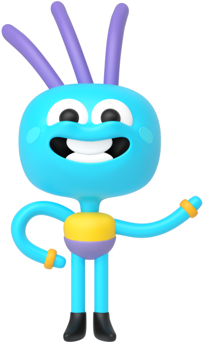

<!DOCTYPE html>
<html lang="en">
<head>
    <meta charset="UTF-8">
    <meta name="viewport" content="width=device-width, initial-scale=1">
    <title>Онлайн-школа Skysmart</title>
    <meta name="description" content="Онлайн-школа Skysmart">
    <link rel="stylesheet" type="text/css" href="styles/css/styles.min.css">
    <link rel="apple-touch-icon" sizes="180x180" href="apple-touch-icon.png">
<link rel="icon" type="image/png" sizes="16x16" href="favicon-16x16.png">
<link rel="manifest" href="site.webmanifest">
<meta name="theme-color" content="#ffffff">
</head>
<body>

<header class="header">
    

        

            
            <nav class="nav header__nav">
                <ul class="nav__list">
                    <li class="nav__item">
                        <a href="" class="nav__link">Все предметы
                            <svg class="nav__link-icon">
                                <use xlink:href="styles/icons/icons.svg#arrow-down"></use>
                            </svg>
                        </a>
                    </li>
                    <li class="nav__item">
                        <a href="" class="nav__link">О школе
                            <svg class="nav__link-icon">
                                <use xlink:href="styles/icons/icons.svg#arrow-down"></use>
                            </svg>
                        </a>
                    </li>
                    <li class="nav__item">
                        <a href="" class="nav__link">Летняя программа →</a>
                    </li>
                </ul>
            </nav>
        

        

            <a href="" class="header__link header__link--hide-on-tablet">Войти</a>
            <a href="" class="header__link header__link--hide-on-tablet">Записаться на урок</a>
            <a href="" class="header__link header__link--hide-on-desktop">Записаться</a>
        

    

</header>

<main class="main-block">
    <section class="section banner-section">
        

            <h1 class="banner-section__title">Онлайн-школа Skysmart</h1>
            

                

                    
все

                    

                

                <svg width="0" height="0">
                    <clipPath id="sticker-1" clipPathUnits="objectBoundingBox">
                        <path d="M0.731,1 H0.269 c-0.148,0.001,-0.269,-0.222,-0.269,-0.497 v-0.005 C0,0.223,0.12,0.001,0.269,0 h0.462 C0.879,0,1,0.222,1,0.498 v0.005 C1,0.778,0.879,1,0.731,1"/>
                    </clipPath>
                </svg>
            

            

                

                    
получится

                    

                

                <svg width="0" height="0">
                    <clipPath id="sticker-2" clipPathUnits="objectBoundingBox">
                        <path d="M0.986,0.44 C0.942,0.356,0.907,0.222,0.884,0.058 C0.88,0.023,0.873,0.005,0.867,0.005 C0.867,0.005,0.867,0.005,0.867,0.005 C0.867,0.005,0.867,0.005,0.867,0.005 C0.865,0.005,0.864,0.005,0.862,0.006 C0.689,0.111,0.312,0.111,0.138,0.006 C0.137,0.005,0.135,0.005,0.134,0.005 C0.127,0.005,0.121,0.022,0.116,0.058 C0.094,0.222,0.058,0.356,0.014,0.44 C-0.005,0.476,-0.005,0.534,0.014,0.57 C0.058,0.653,0.094,0.787,0.116,0.952 C0.121,0.987,0.127,1,0.134,1 C0.135,1,0.137,1,0.138,1 C0.312,0.899,0.689,0.899,0.862,1 C0.864,1,0.865,1,0.867,1 C0.867,1,0.867,1,0.867,1 C0.867,1,0.867,1,0.867,1 C0.873,1,0.88,0.987,0.884,0.952 C0.907,0.787,0.942,0.653,0.986,0.57 C1,0.534,1,0.476,0.986,0.44"/>
                    </clipPath>
                </svg>
            

        

    </section>
    <section class="section advantages-section">
        

            

                

                    <h3 class="advantage-block__title">Подготовиться к школе и весело провести время</h3>
                

                

                    <h3 class="advantage-block__title">Понять сложный предмет и хорошо сдать экзамены</h3>
                

                

                    <h3 class="advantage-block__title">Найти классное хобби, которое пригодится в жизни</h3>
                

            

            

                

                    

                    <svg class="book-lesson-scroll-block__desktop-arrow scroll-to"
                         width="899" height="672" version="1.1" xmlns="http://www.w3.org/2000/svg" x="0px" y="0px"
                         viewBox="0 0 899 672" enable-background="new 0 0 899 672" xml:space="preserve">
                          <clipPath id="stroke1">
                            <path d="M589.7,59c0,2.8-2.4,3.7-13,4.4C533,66.5,454.4,76.3,402.1,85.1C182.1,122.3,51.5,191,27.7,282.2
                                C14.6,332.5,35.3,387.9,87.1,441c33.5,34.3,70.3,60.7,118.6,85.1c86.5,43.7,199.2,66.8,355.9,73.1c33.2,1.3,131.9,0.7,162-1
                                c47-2.7,88.8-6.2,120.5-10.2c23.4-2.9,22.7-2.7,21.3-5.2c-1.9-3.6-10.3-12-16.2-16.2c-3.1-2.2-5.6-4.5-5.6-5c0-0.6,0.9-2.1,1.9-3.4
                                l1.8-2.3l5.4,2.7c13.1,6.7,33.9,24.4,38.4,32.8c2.6,4.8,1.5,5.9-8.5,7.9c-10.5,2.2-22.2,6.9-32.1,12.9c-8.8,5.3-11.1,5.5-11.7,1.1
                                c-0.3-1.6,0.9-2.9,5-5.5c10.3-6.6,23.4-12.3,35.6-15.4l3.3-0.8l-4-3.9c-2.7-2.7-3.8-3.3-3.5-2c1,4-1.8,5.7-11.7,7
                                c-34,4.8-86.4,9.4-133.4,12c-40.2,2.1-129.1,2.9-167,1.5c-112.9-4.4-207.8-18.4-282-41.7C172.3,530.3,77.5,461.5,37.4,387
                                c-33.2-61.5-25.8-122.3,21-172.1C125,144.1,266.5,94,475.6,67c32.1-4.2,110.5-11.7,112.3-10.8C588.8,56.7,589.7,57.9,589.7,59z"/>
                        </clipPath>
                        <path clip-path="url(#stroke1)" class="desktop-book-arrow" stroke-dasharray="3642 7284"
                              stroke-linecap="round" fill="none"
                              d="M584.9,59.39999999999999L459.9,73.19999999999999L345.4,91.69999999999999L223.3,124.49999999999999L142,158.2L87.8,192.39999999999998L51.199999999999996,228.49999999999997L29.299999999999997,264.59999999999997L20.7,300.2L20.7,336L35,373.9L62.6,419.5L102,460.4L144.2,494.1000000000001L200.79999999999998,527.4000000000001L251.7,549.7L322.5,573L418,591.1L529.3,600.7L630.5,604.5L770.2,598.8L869.5,588.3L887.1,593.5"/>
                        <defs>
                          <linearGradient id="gradient1" gradientUnits="userSpaceOnUse" x1="454.6787" y1="56.1758"
                                          x2="454.6787" y2="616.3539">
                            <stop offset="0" style="stop-color:#DAF4FC"/>
                              <stop offset="0.9066" style="stop-color:#22C9FC"/>
                              <stop offset="1" style="stop-color:#0FC4FC"/>
                          </linearGradient>
                        </defs>
                        <clipPath id="free-lesson-block-desktop-back" clipPathUnits="objectBoundingBox">
                            <path d="M0.398,0.854 C0.08,0.721,-0.2,0.437,0.353,0.244 C0.68,0.14,0.278,0.033,0.017,0.062 c-0.506,0.056,-0.743,0.768,-0.075,0.948 C0.369,1,0.74,1,0.398,0.854"/>
                        </clipPath>
                    </svg>
                    <svg class="book-lesson-scroll-block__mobile-arrow scroll-to"
                         version="1.1" id="Layer_1" xmlns="http://www.w3.org/2000/svg" x="0px" y="0px"
                         viewBox="0 0 266 101" enable-background="new 0 0 266 101" xml:space="preserve">
                         <clipPath id="stroke2">
                            <path fill="none" d="M254,100.5c-0.2,0-0.5-0.1-0.7-0.2c-0.6-0.3-0.9-0.9-0.8-1.6c0.1-0.5,0.2-0.9,0.2-1.4c-0.5,0.3-1,0.6-1.5,0.9
                                c-0.5,0.3-1,0.3-1.5,0c-0.5-0.3-0.8-0.8-0.8-1.3c0-6.2-1.4-10.4-4.6-14c-0.6-0.6-0.5-1.6,0.1-2.1c0.6-0.6,1.6-0.5,2.1,0.1
                                c3.9,4.4,5,9.2,5.3,13.3c0.5-0.3,0.9-0.7,1.4-1.1c2.6-24.1-5.4-44.2-24-59.7C185.6-3,87.9-7.1,2,23.9c-0.8,0.3-1.6-0.1-1.9-0.9
                                c-0.3-0.8,0.1-1.6,0.9-1.9C42.3,6.1,88.3-1.2,130.4,0.3c43.1,1.6,78.9,12.6,100.9,30.9C249.4,46.5,258,66.6,256.6,90
                                c1.3-1.5,2.7-3.4,4.3-5.6c0.7-1,1.5-2.1,2.4-3.2c0.4-0.6,1.3-0.8,1.9-0.4c0.7,0.3,1,1.1,0.7,1.8c-3,8.6-4.5,11.4-10.9,17.6
                                C254.8,100.4,254.4,100.5,254,100.5z"/>
                         </clipPath>
                        <path clip-path="url(#stroke2)" class="mobile-book-arrow" stroke-dasharray="825 1650"
                              stroke-linecap="round" fill="none" d="M1.9,22.3l34.4-10.5l24.2-5.3L89,2.7l34.8-1.1l29.9,1.8l25.5,4.8l21.7,7.1l20.1,10.5L239.3,41l10,15l5.2,15.9
                            l0.9,18.5l-1.1,6.4"/>
                        <defs>
                            <linearGradient id="gradient2" gradientUnits="userSpaceOnUse" x1="245.0726" y1="42.5231"
                                            x2="6.5726" y2="91.5232" gradientTransform="matrix(1 0 0 -1 0 102)">
                                <stop offset="0" style="stop-color:#00C1FF"/>
                                <stop offset="1" style="stop-color:#FFFFFF"/>
                            </linearGradient>
                        </defs>

                        <clipPath id="free-lesson-block-mobile-back" clipPathUnits="objectBoundingBox">
                            <path d="M0.002,1 L0.002,0.44 C0.376,-0.208,0.822,-0.129,1,0.751 L1,1 L0.002,1"/>
                        </clipPath>
                    </svg>
                

                <button class="book-lesson-scroll-block__btn blue-btn scroll-to">Бесплатный   вводный урок</button>
            

        

    </section>
    <section class="section tabs-section">
        

            <h2 class="title">Как проходят занятия</h2>
            

                

                    <button class="tabs__btn tabs__btn--active" data-tab="tab-1" title="Вводный урок">Вводный урок
                    </button>
                    <button class="tabs__btn" data-tab="tab-2" title="Английский язык">Английский язык</button>
                    <button class="tabs__btn" data-tab="tab-3" title="Математика">Математика</button>
                

            

            

                

                    <video class="video__item" muted>
                        <source src="img/lesson.mp4" type="video/mp4">
                    </video>
                    <button class="video__btn video-btn video-btn--off" title="Включить звук">
                        <svg class="video-btn__icon video-btn__icon--on">
                            <use xlink:href="styles/icons/icons.svg#sound-on"></use>
                        </svg>
                        <svg class="video-btn__icon video-btn__icon--off">
                            <use xlink:href="styles/icons/icons.svg#sound-off"></use>
                        </svg>
                    </button>
                

            

            

                

                    <video class="video__item" muted>
                        <source src="img/english.mp4" type="video/mp4">
                    </video>
                    <button class="video__btn video-btn video-btn--off" title="Включить звук">
                        <svg class="video-btn__icon video-btn__icon--on">
                            <use xlink:href="styles/icons/icons.svg#sound-on"></use>
                        </svg>
                        <svg class="video-btn__icon video-btn__icon--off">
                            <use xlink:href="styles/icons/icons.svg#sound-off"></use>
                        </svg>
                    </button>
                

            

            

                

                    <video class="video__item" muted>
                        <source src="img/math.mp4" type="video/mp4">
                    </video>
                    <button class="video__btn video-btn video-btn--off" title="Включить звук">
                        <svg class="video-btn__icon video-btn__icon--on">
                            <use xlink:href="styles/icons/icons.svg#sound-on"></use>
                        </svg>
                        <svg class="video-btn__icon video-btn__icon--off">
                            <use xlink:href="styles/icons/icons.svg#sound-off"></use>
                        </svg>
                    </button>
                

            

        

    </section>
    <section class="section game">
        

            <h2 class="game__mobile-title title">Чтобы записаться на вводный урок, покормите Эла</h2>
            

                <svg class="game-img__mobile-arrow" version="1.1" xmlns="http://www.w3.org/2000/svg" xmlns:xlink="http://www.w3.org/1999/xlink" x="0px" y="0px"
                     viewBox="0 0 322 298" enable-background="new 0 0 322 298" xml:space="preserve">
                        <linearGradient id="gradient3" gradientUnits="userSpaceOnUse" x1="271.9959" y1="128.5285" x2="33.4955" y2="177.5289" gradientTransform="matrix(1 0 0 -1 0 300)">
                            <stop  offset="0" style="stop-color:#00C1FF"/>
                            <stop  offset="1" style="stop-color:#FFFFFF"/>
                        </linearGradient>
                    <clipPath id="stroke4">
                            <path  d="M5,242c-0.1,0-0.1,0-0.2,0c-0.8-0.1-1.4-0.8-1.3-1.7C22,73,103.6,20.2,173.7,26.7
                                c32.2,2.9,63.6,18.6,86.1,43c21.7,23.5,33.3,52.7,33.2,83c1.6-1.7,3.1-3.8,5.1-6.5c0.7-1,1.5-2.1,2.4-3.2c0.4-0.6,1.3-0.8,1.9-0.4
                                c0.7,0.3,1,1.1,0.7,1.8c-3,8.6-4.5,11.4-10.9,17.6c-0.4,0.4-1.1,0.5-1.7,0.3c-0.6-0.3-0.9-0.8-0.9-1.5c0-0.5,0.1-0.9,0.1-1.4
                                c-0.4,0.3-0.9,0.5-1.3,0.8c-0.5,0.3-1,0.3-1.5,0c-0.5-0.3-0.8-0.8-0.8-1.3c0-6.2-1.4-10.4-4.6-14c-0.6-0.6-0.5-1.6,0.1-2.1
                                c0.6-0.6,1.6-0.5,2.1,0.1c3.9,4.4,5,9.2,5.3,13.3c0.3-0.2,0.6-0.4,0.9-0.6c1.9-69-57.7-120.5-116.5-125.9
                                c-68.7-6.3-148.7,45.8-167,211C6.4,241.4,5.8,242,5,242z M292.9,157C292.9,157,292.9,157,292.9,157C293,157,293,157,292.9,157
                                C293,157,293,157,292.9,157z"/>
                        </clipPath>
                    <path  clip-path="url(#stroke4)" class="mobile-game-arrow" stroke-dasharray="1987 3974"
                           stroke-linecap="round" fill="none" d="M5.1,239.2l4.3-30.8l5-23.6l6.5-25.3l12.7-33.3l17.1-32.1l23.7-29l19.1-15.9L116,37.1l24.1-7.3l23.2-2.1
                            l21.4,2.1l18.7,4.5l18.9,8.6l18.7,11.9l19.8,17.8l11.4,15.5l11.4,22.5l6.6,21.6l2,20.3l-1.1,7.3"/>
                        </svg>
                
                
                

                    
                

            

            

                <h2 class="game__desktop-title title">Чтобы записаться на вводный урок, покормите Эла</h2>
                

                   

                       

                           
получилось

                           

                           <svg width="0" height="0">
                               <clipPath id="sticker-3" clipPathUnits="objectBoundingBox">
                                   <path d="M0.987,0.439 C0.947,0.355,0.914,0.221,0.894,0.056 C0.89,0.022,0.884,0.004,0.878,0.004 C0.878,0.004,0.878,0.004,0.878,0.004 C0.878,0.004,0.878,0.004,0.878,0.004 C0.876,0.004,0.875,0.004,0.873,0.005 C0.715,0.11,0.286,0.11,0.127,0.005 C0.125,0.004,0.124,0.004,0.123,0.004 C0.117,0.004,0.111,0.021,0.106,0.056 C0.086,0.221,0.053,0.355,0.013,0.439 C-0.004,0.475,-0.004,0.533,0.013,0.569 C0.053,0.652,0.086,0.786,0.106,0.951 C0.111,0.986,0.117,1,0.123,1 C0.124,1,0.125,1,0.127,1 C0.286,0.898,0.715,0.898,0.873,1 C0.875,1,0.876,1,0.878,1 C0.878,1,0.878,1,0.878,1 C0.878,1,0.878,1,0.878,1 C0.884,1,0.89,0.986,0.894,0.951 C0.914,0.786,0.947,0.652,0.987,0.569 C1,0.533,1,0.475,0.987,0.439"/>
                               </clipPath>
                           </svg>
                       

                   

                    <svg class="game-info__desktop-arrow"
                         version="1.1" xmlns="http://www.w3.org/2000/svg" xmlns:xlink="http://www.w3.org/1999/xlink" x="0px" y="0px"
                         viewBox="0 0 492.8 235" enable-background="new 0 0 492.8 235" xml:space="preserve">
                        <clipPath id="stroke3">
                            <path d="M485,153.4c-28.9-38.3-65.2-63.2-107.9-73.8c-61.7-15.4-132.6-8.9-194.3,17.7c-12.5,5.4-30.9,14.9-41.3,21.5l-9.4,5.9
                                l-0.7-14.1c-0.3-7.8-1.1-17.4-1.8-21.2c-7.6-47-30.5-71.2-65.4-69.1c-13.7,0.9-23.9,3.6-41.3,11.3c-2.3,0.9-1.4-1.5,5.3-14.9
                                C31.8,9.7,30.1,1,29,0c-1.9,2-3.7,4.1-5.6,6.1C13.8,17.3,1,34.7,0,53.5c0.8,0.3,6-0.4,11.5-1.5c12.7-2.7,17-2.6,25.3,0.1
                                c5.5,1.8,7,1.9,8.2,0.8c0.9-0.7,1.6-1.9,1.6-2.6c0-4-14.7-8.1-25.3-7.1l-6,0.6l-3.1,0.7c-0.2,0.3-0.8,0.4-2,0.4
                                c-2.4,0-2.5-0.2-1.4-2.6c0.8-1.7,1.4-2.1,1.6-1.3c0.3,0.8,0.9,2,1.5,2.6c0.2,0.3,0.3,0.6,0.3,0.8l3.2-0.7l6.6-3.3
                                c10.7-5.6,21.3-9.5,30.6-11.5c21.2-4.4,36.7-0.4,49.3,13c14.3,15.2,21.2,36.9,22.4,70.1l0.6,17.5l-11.4,9.1
                                c-12.8,10.3-28.8,26.4-36.7,36.9c-20.3,27.3-28.5,58.2,11.8,59.6c8.8-2.7,16.7-10.9,23.8-24.8c8.6-16.8,16-44.1,17.7-65.3
                                c0.4-4.7,1.1-9.2,1.6-10.1c1.2-2.4,17.4-12.6,31.9-20.2c40.4-21.2,83.7-33.3,129.5-36c25.2-1.6,58,1.6,81.9,7.8
                                c21.5,5.6,42.3,15.1,59.6,27.3c12.4,8.7,37.2,33.5,46.5,46.5c6.3,8.9,8.9,10.4,11.4,10l0.3-6.9C492.3,162.8,488.8,158.3,485,153.4z
                                 M118.6,171.4c-7.4,31.5-21,54.5-33.7,57.1c-4.4,0.9-11.6-2.7-14.4-7.2c-3.3-5.5-2.4-15.6,2.4-25.6c7.1-14.6,21.8-32.1,40.2-47.5
                                c5.5-4.6,10.1-7.9,10.3-7.3C123.9,142.3,120.8,161.7,118.6,171.4z"/>
                        </clipPath>
                        <path clip-path="url(#stroke3)" class="desktop-game-arrow" stroke-dasharray="1987 3974"
                              stroke-linecap="round" fill="none" d="M489.6,165.20000000000002L456.1,126.30000000000001L406.90000000000003,92.80000000000001L363.1,78.9L300,75L243.40000000000003,81.69999999999999L189.20000000000002,96.69999999999999L138.20000000000002,123.8L107.50000000000001,147L75.80000000000001,182.29999999999998L63.300000000000004,209.39999999999998L66.9,225.39999999999998L82.9,231.79999999999998L96,227.2L107.3,212L116.89999999999999,188.1L125.49999999999999,158.2L127.99999999999999,117.6L124.69999999999999,77.3L111.19999999999999,44L93.39999999999999,28.999999999999996L70.6,23.299999999999997L46.8,26.599999999999998L28.5,33.8L13.8,39L21.9,15.3"/>
                    </svg>
                    

                        
                    

                

            

        

    </section>
</main>
<footer class="footer">
    

        

            
            
© 2021

        

        

            <a href="" class="footer__link">Сделать бочку</a>
        

    

</footer>

</body>
</html>
